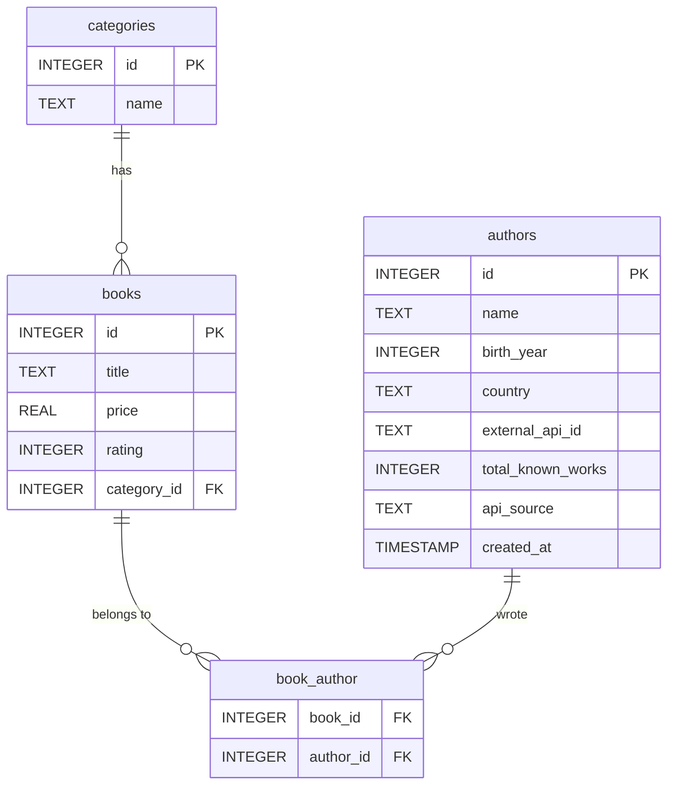

# 📚 Books To Scrape — Data Engineering Challenge

A complete data pipeline that scrapes **1,000 books** from [books.toscrape.com](https://books.toscrape.com), enriches author data via external APIs (OpenLibrary + Wikipedia), stores everything in a normalized SQLite database, and delivers analytical queries with indexing performance analysis.

---

## 🗂️ Table of Contents

- [Overview](#overview)
- [Project Structure](#project-structure)
- [Database Schema (UML)](#database-schema-uml)
- [Tech Stack](#tech-stack)
- [Pipeline Architecture](#pipeline-architecture)
- [API Integration](#api-integration)
- [SQL Queries](#sql-queries)
- [Indexing & Performance](#indexing--performance)
- [Visualizations](#visualizations)
- [Enrichment Report](#enrichment-report)
- [How to Run](#how-to-run)
- [Bonus Features](#bonus-features)

---

## Overview

This project was built as a data engineering challenge. The goal was to:

1. Scrape **all 50 pages** and **1,000 books** from Books To Scrape
2. Enrich each book with **author metadata** from public REST APIs
3. Persist everything in a **normalized relational database**
4. Answer business questions via **SQL queries**
5. Demonstrate **indexing performance improvements**

---

## Project Structure

```
books_scraper/
│
├── web_scraping_sql_analysis.ipynb    # Main Jupyter Notebook (all cells)
├── books.db                           # SQLite database (auto-generated)
├── scrape.log                         # Logging output
└── README.md                          # This file
```

---

## Database Schema (UML)



### Relationships

| Relationship | Type | Description |
|---|---|---|
| `books` → `categories` | Many-to-One | Each book belongs to one category |
| `books` ↔ `authors` | Many-to-Many | Via `book_author` junction table |

### Key Constraints

- `books.title` — UNIQUE (prevents duplicate inserts on re-runs)
- `authors.external_api_id` — UNIQUE (one record per API author)
- `categories.name` — UNIQUE
- All foreign keys enforced via `FOREIGN KEY` declarations

---

## Tech Stack

| Tool | Purpose |
|---|---|
| `requests` | HTTP requests (scraping + API calls) |
| `BeautifulSoup` | HTML parsing |
| `sqlite3` | Relational database |
| `pandas` | Data display & SQL result handling |
| `matplotlib` | Data visualization |
| `logging` | Error and info logging to `scrape.log` |
| `time` | Rate limiting & performance measurement |
| `re` | Regex for year extraction |

---

## Pipeline Architecture

```
[books.toscrape.com]
        │
        ▼
 fetch_page(url)          ← BeautifulSoup HTML parser
        │
        ▼
 extract_books(soup)      ← Extracts title, price, rating, category
        │
        ├──► get_author(title)
        │         │
        │         ├──► OpenLibrary Search API  (/search.json)
        │         ├──► OpenLibrary Author API  (/authors/{key}.json)
        │         └──► Wikipedia REST API      (fallback)
        │
        ▼
 insert_book(conn, book)  ← SQLite INSERT OR IGNORE
        │
        ▼
 get_next_page(soup)      ← Pagination loop (50 pages)
```

---

## API Integration

### Primary: OpenLibrary

- **Search endpoint:** `https://openlibrary.org/search.json?title=...`
- **Author endpoint:** `https://openlibrary.org/authors/{key}.json`
- **Works endpoint:** `https://openlibrary.org/authors/{key}/works.json`

### Fallback: Wikipedia REST API

- **Endpoint:** `https://en.wikipedia.org/api/rest_v1/page/summary/{author}`
- Used when OpenLibrary returns incomplete `birth_year` or `country`

### Fields Collected

| Field | Source |
|---|---|
| `author_name` | OpenLibrary |
| `author_id` | OpenLibrary (e.g. `OL23919A`) |
| `birth_year` | OpenLibrary → Wikipedia fallback |
| `country` | `birth_place` field → bio parsing → Wikipedia |
| `work_count` | OpenLibrary works endpoint |
| `api_source` | `"OpenLibrary API"` or `"Wikipedia API"` |

### Error Handling

- HTTP errors → `logging.error()` + return `empty_result` dict (all `None`)
- Timeouts → `timeout=5` on all requests
- Author not found → all fields stored as `NULL`
- In-memory cache (`author_cache`) avoids duplicate API calls per title

---

## SQL Queries

### Query 1 — Books with rating ≥ 3 and price < £20
```sql
SELECT title, price, rating FROM books
WHERE rating >= 3 AND price < 20
LIMIT 10;
```

### Query 2 — Authors with worst average rating (min. 5 books)
```sql
SELECT a.name AS author, AVG(b.rating) AS avg_rating, COUNT(*) AS total_books
FROM authors a
JOIN book_author ba ON a.id = ba.author_id
JOIN books b ON b.id = ba.book_id
GROUP BY a.id
HAVING COUNT(*) >= 5
ORDER BY avg_rating;
```

### Query 3 — Categories with highest average price
```sql
SELECT c.name AS category, AVG(b.price) AS avg_price, COUNT(*) AS total_categories
FROM categories c
JOIN books b ON c.id = b.category_id
GROUP BY c.id
ORDER BY avg_price DESC
LIMIT 10;
```

### Query 4 — Top 5 authors by book count
```sql
SELECT a.name AS author, COUNT(*) AS total_books
FROM authors a
JOIN book_author b ON b.author_id = a.id
GROUP BY a.id
ORDER BY COUNT(*) DESC
LIMIT 5;
```

### Query 5 (Mandatory) — Countries with most highly-rated books (rating > 3)
```sql
SELECT a.country, COUNT(*) AS total_books
FROM books b
JOIN book_author ba ON b.id = ba.book_id
JOIN authors a ON a.id = ba.author_id
WHERE b.rating > 3 AND country IS NOT NULL
GROUP BY a.country
ORDER BY total_books DESC
LIMIT 5;
```

> ⚠️ This query **requires the API integration** to work — without author country data, it returns no results.

---

## Indexing & Performance

### Indexes Created

```sql
CREATE INDEX IF NOT EXISTS idx_books_rating       ON books(rating);
CREATE INDEX IF NOT EXISTS idx_authors_country    ON authors(country);
CREATE INDEX IF NOT EXISTS idx_book_author_book   ON book_author(book_id);
CREATE INDEX IF NOT EXISTS idx_book_author_author ON book_author(author_id);
```

### Benchmark Query

```sql
SELECT b.title, b.price, a.name, a.country
FROM books b
JOIN book_author ba ON b.id = ba.book_id
JOIN authors a ON a.id = ba.author_id
WHERE a.country = 'United Kingdom' AND b.rating >= 4;
```

### Results

| Metric | Value |
|---|---|
| Time **without** index | ~0.0022 seconds |
| Time **with** index | ~0.0013 seconds |
| Time difference | ~0.0009 seconds |
| Performance improvement | **41.33%** |

> **Note:** The improvement is relatively small due to the limited dataset size (~1,000 rows). With larger datasets, indexing provides dramatically greater gains, since B-tree lookups scale as O(log n) versus O(n) for full table scans.

---

## Visualizations

Three bar charts were generated from SQL query results:

1. **Category with Highest Average Price** — Suspense leads at ~£58.33
2. **Top 5 Authors with Most Books** — Stephen King tops the list with 12 books
3. **Countries with Most Highly-Rated Books** — United States dominates with 182 books

---

## Enrichment Report

Final scraping statistics after processing all 1,000 books:

| Metric | Value |
|---|---|
| Total books scraped | 1,000 |
| Books with author data | 939 / 1,000 (93.9%) |
| Books with country data | 704 / 1,000 (70.4%) |
| Books missing author | 61 |
| Books missing country | 296 |

---

## How to Run

### Prerequisites

```bash
pip install requests beautifulsoup4 pandas matplotlib
```

### Steps

1. Clone the repository
2. Open `web_scraping_sql_analysis.ipynb` in Jupyter
3. Run all cells in order (Cell 1 → Cell 10)
4. The database `books.db` will be created automatically
5. All logs will be written to `scrape.log`

> ⚠️ Full execution takes significant time due to ~1,000 individual book page requests + API calls. The in-memory cache reduces redundant API calls for repeated authors.

---

## Bonus Features

- [x] 📊 Bar charts for 3 queries (matplotlib)
- [x] 📡 In-memory API cache (`author_cache` dict) to avoid duplicate calls
- [x] 📈 Enrichment report with % of authors and countries found
- [x] 🛑 Dual-API fallback (OpenLibrary → Wikipedia)
- [x] 💾 Incremental DB writes (each page saved immediately to prevent data loss on crash)

---

*Built with 🐍 Python · SQLite · BeautifulSoup · OpenLibrary API · Wikipedia API*
