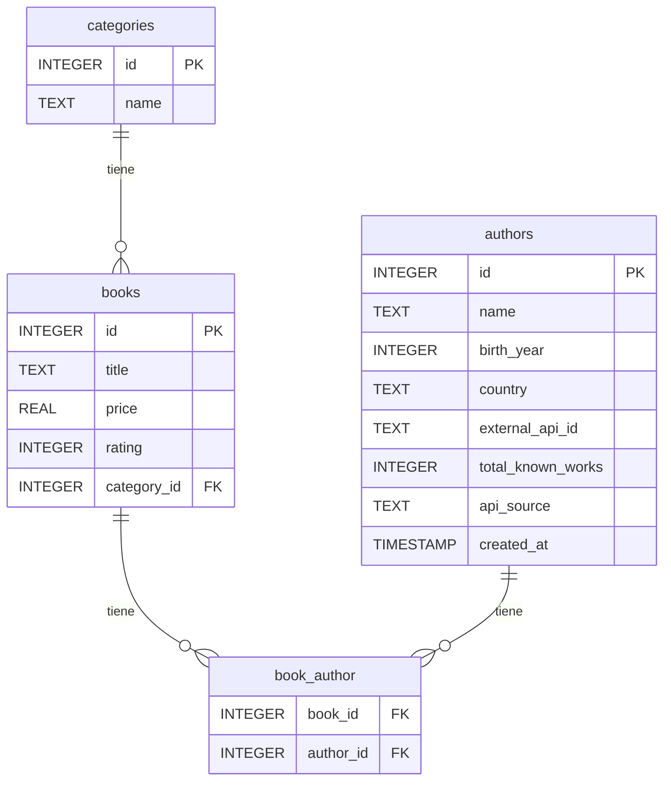

# 📚 Books to Scrape — Data Pipeline Challenge

Pipeline completo de scraping, enriquecimiento con API y análisis de datos sobre el sitio [Books to Scrape](https://books.toscrape.com).

---

## 🗺️ Diagrama UML — Modelo Relacional



> Relación muchos a muchos entre `books` y `authors` implementada mediante la tabla intermedia `book_author`.

---

## 🏗️ Estructura del proyecto

```
├── challenge.ipynb       # Notebook principal con todo el pipeline
├── books.db              # Base de datos SQLite (generada al correr el notebook)
└── README.md             # Este archivo
```

---

## ⚙️ Pipeline

```
Books to Scrape ──► Scraping (BeautifulSoup) ──► Open Library API
                                │                        │
                                └────────────────────────┘
                                             │
                                      SQLite (books.db)
                                             │
                                      Consultas SQL + Análisis
```

### Pasos del pipeline

1. **Scraping** — se recorren las 50 páginas del catálogo extrayendo título, precio y rating de cada libro.
2. **Enriquecimiento** — por cada libro se consulta la API de Open Library para obtener autor, año de nacimiento, país y cantidad de obras.
3. **Persistencia** — los datos se insertan en SQLite de forma incremental (página por página) con deduplicación automática.
4. **Análisis** — se ejecutan consultas SQL con JOINs, GROUP BY, subconsultas y funciones de ventana.
5. **Performance** — se mide el tiempo de ejecución de consultas antes y después de agregar índices.

---

## 🗄️ Esquema de la base de datos

### `categories`
| Campo | Tipo | Descripción |
|-------|------|-------------|
| id | INTEGER PK | Identificador único |
| name | TEXT UNIQUE | Nombre de la categoría |

### `books`
| Campo | Tipo | Descripción |
|-------|------|-------------|
| id | INTEGER PK | Identificador único |
| title | TEXT UNIQUE | Título del libro |
| price | REAL | Precio en libras (£) |
| rating | INTEGER | Rating de 1 a 5 |
| category_id | INTEGER FK | Referencia a `categories` |

### `authors`
| Campo | Tipo | Descripción |
|-------|------|-------------|
| id | INTEGER PK | Identificador único |
| name | TEXT | Nombre del autor |
| birth_year | INTEGER | Año de nacimiento (de la API) |
| country | TEXT | País de origen (de la API) |
| external_api_id | TEXT UNIQUE | ID en Open Library (ej: OL39232A) |
| total_known_works | INTEGER | Cantidad de obras según la API |
| api_source | TEXT | Fuente utilizada |
| created_at | TIMESTAMP | Fecha de inserción |

### `book_author`
| Campo | Tipo | Descripción |
|-------|------|-------------|
| book_id | INTEGER FK | Referencia a `books` |
| author_id | INTEGER FK | Referencia a `authors` |

---

## 🌐 API utilizada

**Open Library** — `https://openlibrary.org`

Se realizan hasta 3 llamadas por libro:
1. `GET /search.json?title=...` → obtener `author_key` y `author_name`
2. `GET /authors/{key}.json` → obtener `birth_date` y `birth_place` / `bio`
3. `GET /authors/{key}/works.json` → obtener `size` (cantidad de obras)

### Manejo de errores
- `HTTPError` (404, 5xx) → se guarda `NULL` y se registra en el log
- `RequestException` (timeout, sin conexión) → ídem
- Autor no encontrado en la API → todos los campos en `NULL`
- Cache local (`dict`) para evitar llamadas duplicadas al mismo título

---

## 📊 Consultas implementadas

1. **Libros con más de 3 estrellas por menos de £10**
2. **Autor con peor promedio de rating** (mínimo 5 libros)
3. **Categoría con mayor precio promedio**
4. **Top 5 autores con más libros**
5. **País con más libros con rating mayor a 3** *(obligatoria — requiere JOIN con authors)*

---

## ⚡ Indexación y performance

Se demuestra la diferencia de tiempo de ejecución en una consulta sobre `price` y `rating` antes y después de crear el índice:

```sql
CREATE INDEX idx_books_price_rating ON books(price, rating);
```

---

## 📦 Dependencias

```python
requests
beautifulsoup4
sqlite3      # stdlib
logging      # stdlib
time         # stdlib
urllib.parse # stdlib
```

---

## 🎁 Bonus implementados

- [x] Cache de API para evitar llamadas duplicadas
- [x] Reporte de porcentaje de autores no encontrados
- [x] Gráfico generado desde una consulta SQL
- [x] Guardado incremental (no se pierden datos si el scraping se interrumpe)
